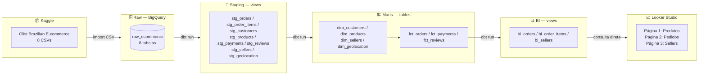

# Portfolio E-commerce (Olist)

Projeto de Analytics Engineering usando dbt Core + Google BigQuery com o dataset público [Olist Brazilian E-commerce](https://www.kaggle.com/datasets/olistbr/brazilian-ecommerce).

## Arquitetura



### Resumo das camadas

| Camada | Localização | Materialização | Função |
|--------|-------------|:---:|--------|
| **Fonte** | [Kaggle - Olist](https://www.kaggle.com/datasets/olistbr/brazilian-ecommerce) | 8 arquivos CSV | Dados públicos de e-commerce brasileiro |
| **Raw** | `raw_ecommerce` no BigQuery | Tabelas importadas | Dados como vieram do Kaggle |
| **Staging** | `raw_ecommerce_staging` | Views | CASTs, padronização de nomes, INITCAP/UPPER |
| **Marts** | `raw_ecommerce_marts` | Tables | Star schema: dimensões + fatos com surrogate keys MD5 |
| **BI** | `raw_ecommerce_marts` | Views | Denormalização para consumo direto do Looker Studio |
| **Dashboard** | Looker Studio | Gráficos e filtros | 3 páginas com KPIs de produtos, pedidos e sellers |

## Stack

- **Data Warehouse:** Google BigQuery (`us-central1`)
- **Transformação:** dbt Core v1.11 (dbt-bigquery)
- **Linguagem:** SQL (dialeto BigQuery) com Jinja
- **Visualização:** Looker Studio
- **Pacotes:** `dbt_utils` v1.1.1

## Estrutura do Projeto

```
raw_ecommerce/
├── models/
│   ├── staging/        # 8 modelos de limpeza (views)
│   │   ├── sources.yml
│   │   ├── schema.yml
│   │   ├── stg_orders.sql
│   │   ├── stg_order_items.sql
│   │   ├── stg_customers.sql
│   │   ├── stg_products.sql
│   │   ├── stg_payments.sql
│   │   ├── stg_reviews.sql
│   │   ├── stg_sellers.sql
│   │   └── stg_geolocation.sql
│   ├── marts/          # 7 modelos dimensionais (tables)
│   │   ├── schema.yml
│   │   ├── exposures.yml
│   │   ├── dim_customers.sql
│   │   ├── dim_products.sql
│   │   ├── dim_sellers.sql
│   │   ├── dim_geolocation.sql
│   │   ├── fct_orders.sql
│   │   ├── fct_payments.sql
│   │   └── fct_reviews.sql
│   └── bi/             # 3 modelos para dashboard (views)
│       ├── bi_orders.sql
│       ├── bi_order_items.sql
│       └── bi_sellers.sql
├── macros/             # 4 macros Jinja customizadas
├── tests/              # 1 teste singular
├── seeds/              # Seeds (vazio)
├── snapshots/          # Snapshots (vazio)
├── analyses/           # Análises ad-hoc (vazio)
├── requirements.txt
└── dbt_project.yml
```

## Modelagem

### Camada Staging (8 views)

Aplica tipagem explícita, padronização de nomes, `INITCAP` em cidades e `UPPER` em estados.

| Modelo | Linhas | Descrição |
|--------|-------:|-----------|
| `stg_orders` | 99.441 | Pedidos com timestamps convertidos |
| `stg_order_items` | 112.650 | Itens com preço/frete como NUMERIC |
| `stg_customers` | 99.441 | Clientes com cidade/estado padronizados |
| `stg_products` | 32.951 | Produtos com dimensões físicas |
| `stg_payments` | 103.886 | Pagamentos (tipos, parcelas, valores) |
| `stg_reviews` | 99.224 | Avaliações com notas e timestamps |
| `stg_sellers` | 3.095 | Vendedores com localização |
| `stg_geolocation` | 1.000.163 | Coordenadas geográficas por CEP |

### Camada Marts (7 tables)

Star schema com surrogate keys (MD5) e métricas agregadas.

**Dimensões:**

| Modelo | Linhas | Chave |
|--------|-------:|-------|
| `dim_customers` | 99.441 | `customer_key` (MD5 de customer_id) |
| `dim_products` | 32.951 | `product_key` (MD5 de product_id) |
| `dim_sellers` | 3.095 | `seller_key` (MD5 de seller_id) |
| `dim_geolocation` | 19.000 | `geolocation_key` (MD5 de zip_code_prefix) — particionada e clusterizada |

**Fatos:**

| Modelo | Linhas | Grão |
|--------|-------:|------|
| `fct_orders` | 99.441 | 1 linha = 1 pedido. Contém delivery_delay_days, approval_hours, delivery_status, payment_value, avg_review_score |
| `fct_payments` | 99.441 | Valores pivotados por tipo (credit_card, boleto, voucher, debit_card) |
| `fct_reviews` | 98.688 | Agregação de notas (avg, min, max, five_star_count, one_star_count) |

### Camada BI (3 views)

Denormalizadas para consumo direto no Looker Studio — sem necessidade de JOINs nas queries.

#### `bi_orders` — Visão por pedido

| Coluna | Descrição |
|--------|-----------|
| `order_key` a `avg_review_response_hours` | Dados de fct_orders |
| `credit_card_value`, `boleto_value`, `debit_card_value`, `voucher_value` | Breakdown do pagamento |
| `customer_city`, `customer_state` | Localização do cliente |
| `year_month`, `year`, `month` | Datas pré-extraídas para filtros |

#### `bi_order_items` — Visão por item

| Coluna | Descrição |
|--------|-----------|
| `product_category_group` | Categoria agrupada em português (28 grupos) |
| `product_category_name` | Categoria original |
| `price`, `freight_value`, `total_item_value` | Métricas financeiras por item |
| `seller_city`, `seller_state` | Localização do vendedor |

#### `bi_sellers` — Visão por vendedor

| Coluna | Descrição |
|--------|-----------|
| `seller_key` a `last_sale_at` | Dados da dimensão |
| `avg_item_price`, `avg_freight_value` | Médias por seller |
| `total_orders`, `on_time_orders` | Volume e performance |
| `on_time_rate` | % de entregas no prazo |
| `avg_delivery_delay_days` | Dias médios de atraso |

## Macros Customizadas

| Macro | Localização | Função |
|-------|-------------|--------|
| `generate_schema_name` | `macros/generate_schema_name.sql` | Nomeia schemas como `{target_schema}_staging` e `{target_schema}_marts` |
| `delivery_performance` | `macros/delivery_performance.sql` | Classifica entrega como `on_time`, `late` ou `pending` |
| `pivot_column` | `macros/pivot_column.sql` | Pivotiza valores de coluna em colunas separadas com agregação |
| `describe_model` | `macros/describe_model.sql` | Utilitário que loga colunas e tipos de uma tabela via INFORMATION_SCHEMA |

## Dashboard (Looker Studio)

3 páginas conectadas diretamente às views `bi_orders`, `bi_order_items` e `bi_sellers`.

| Página | View | KPIs |
|--------|------|------|
| **Produtos** | `bi_order_items` | Itens vendidos, produtos distintos, preço médio, receita por categoria, top 20 produtos, frete médio |
| **Pedidos** | `bi_orders` | Total de pedidos, receita total, ticket médio, pedidos por mês, delivery on-time vs late, pagamentos por tipo |
| **Sellers** | `bi_sellers` | Total de sellers, receita total gerada, ticket médio, top sellers, sellers por estado, % on-time, atraso médio |

## Testes

**31 testes de qualidade** (todos PASS):

- `unique` + `not_null` em todas as surrogate keys (customer_key, product_key, seller_key, geolocation_key, order_key, payment_key)
- `accepted_values` para `order_status` (8 valores válidos)
- `relationships` entre `fct_orders.customer_key` e `dim_customers.customer_key`
- `expression_is_true` para valores não negativos (price, freight_value, total_order_value)
- Teste singular: `assert_fct_orders_delivery_delay_non_negative`

## Comandos

| Comando | Descrição |
|---------|-----------|
| `dbt debug` | Testa conexão com BigQuery |
| `dbt deps` | Instala pacotes (dbt_utils) |
| `dbt run` | Executa todos os modelos (8 views + 7 tables + 3 views) |
| `dbt test` | Executa 31 testes de qualidade |
| `dbt build` | `run` + `test` em um comando |
| `dbt docs generate` | Gera documentação e lineage |
| `dbt docs serve` | Serve documentação em http://localhost:8080 |

## Setup

```bash
python -m venv venv
.\venv\Scripts\activate      # Windows
pip install -r requirements.txt
```

Configure `~/.dbt/profiles.yml`:

```yaml
portfolio_ecommerce:
  outputs:
    dev:
      type: bigquery
      method: service-account
      project: portfolio-ecommerce-499523
      dataset: raw_ecommerce
      keyfile: D:\caminho\para\chave.json
      location: us-central1
  target: dev
```

## Licença

Projeto de portfólio. Dados do [Olist Brazilian E-commerce](https://www.kaggle.com/datasets/olistbr/brazilian-ecommerce).
