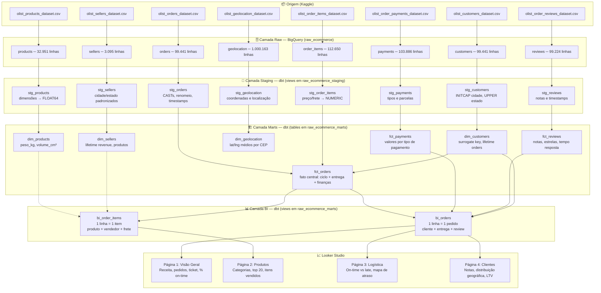

# Portfolio E-commerce (Olist)

Projeto de Analytics Engineering usando dbt Core + Google BigQuery com o dataset público [Olist Brazilian E-commerce](https://www.kaggle.com/datasets/olistbr/brazilian-ecommerce).

## Arquitetura



### Resumo das camadas

| Camada | Localização | Materialização | Função |
|--------|-------------|:---:|--------|
| **Raw** | `raw_ecommerce` no BigQuery | Tabelas importadas do CSV | Dados exatamente como vieram do Kaggle |
| **Staging** | `raw_ecommerce_staging` | Views | CASTs explícitos, padronização de nomes, INITCAP/UPPER |
| **Marts** | `raw_ecommerce_marts` | Tables | Star schema: dimensões (surrogate keys MD5) + fatos com métricas |
| **BI** | `raw_ecommerce_marts` | Views | Denormalização para consumo direto do Looker Studio |
| **Dashboard** | Looker Studio | Gráficos e filtros | 4 páginas com KPIs de receita, entregas, produtos e clientes |

A tabela `fct_orders` é a **fato central** do modelo, conectando pedidos a pagamentos, avaliações e dimensões de cliente. Todas as chaves são hashes MD5 gerados via `dbt_utils.generate_surrogate_key`.

## Stack


- **Data Warehouse:** Google BigQuery
- **Transformação:** dbt Core v1.11 (dbt-bigquery)
- **Linguagem:** SQL (dialeto BigQuery) com Jinja
- **Visualização:** Looker Studio (futuro)

## Modelagem

### Camada Staging (8 modelos, materializados como views)

Aplica tipagem explícita, padronização de nomes, `INITCAP` em cidades e `UPPER` em estados.

| Modelo | Descrição |
|--------|-----------|
| `stg_orders` | Pedidos com timestamps convertidos |
| `stg_order_items` | Itens dos pedidos com preço/frete como NUMERIC |
| `stg_customers` | Clientes com cidade/estado padronizados |
| `stg_products` | Produtos com dimensões físicas |
| `stg_payments` | Pagamentos (tipos, parcelas, valores) |
| `stg_reviews` | Avaliações com notas e timestamps |
| `stg_sellers` | Vendedores com localização |
| `stg_geolocation` | Coordenadas geográficas por CEP |

### Camada Marts (7 modelos, materializados como tables)

Star schema com surrogate keys (MD5) e métricas agregadas.

**Dimensões:**
- `dim_customers` — dados demográficos + lifetime orders
- `dim_products` — categoria, peso (kg), volume (cm³)
- `dim_sellers` — localização + lifetime revenue
- `dim_geolocation` — coordenadas médias por CEP (particionada por `zip_code_prefix`, clusterizada por `state`)

**Fatos:**
- `fct_orders` — fato central (ciclo do pedido, delivery delay, métricas financeiras e de review)
- `fct_payments` — valores por tipo de pagamento (credit_card, boleto, voucher, debit_card)
- `fct_reviews` — agregação de notas (avg, min, max, contagem de estrelas)

## Pré-requisitos

- Python 3.14+
- Google Cloud Platform (projeto + service account com BigQuery User + Data Editor)

## Setup

```bash
python -m venv venv
.\venv\Scripts\activate      # Windows
pip install -r requirements.txt
```

Configure `profiles.yml` em `~/.dbt/profiles.yml`:

```yaml
portfolio_ecommerce:
  outputs:
    dev:
      type: bigquery
      method: service-account
      project: [SEU_PROJETO]
      dataset: portfolio_ecommerce
      keyfile: [CAMINHO_DA_CHAVE_JSON]
      location: US
  target: dev
```

## Comandos

| Comando | Descrição |
|---------|-----------|
| `dbt debug` | Testa conexão com BigQuery |
| `dbt deps` | Instala pacotes (dbt_utils) |
| `dbt run` | Executa todos os modelos |
| `dbt test` | Executa testes de qualidade |
| `dbt build` | `run` + `test` em um comando |
| `dbt docs generate` | Gera documentação e lineage |
| `dbt docs serve` | Serve documentação localmente |

## Testes

- **Testes declarativos** em `schema.yml`:
  - `unique` + `not_null` em todas as surrogate keys
  - `accepted_values` para `order_status`
  - `relationships` entre `fct_orders.customer_key` e `dim_customers`
  - `expression_is_true` para valores não negativos
- **Testes singulares** em `tests/assert_*.sql`

## Licença

Projeto de portfólio. Dados do [Olist](https://www.kaggle.com/datasets/olistbr/brazilian-ecommerce).
